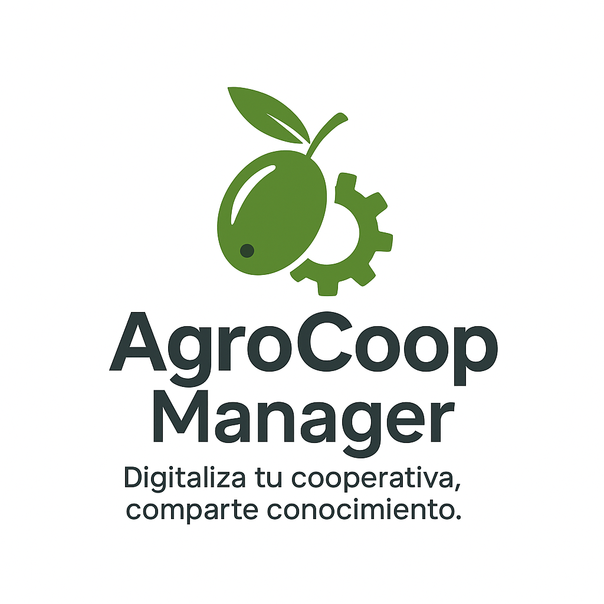

# 🌿 AgroCoop Manager

**Digitalización inteligente para cooperativas agrícolas andaluzas**

---

## 📋 Descripción del proyecto

**AgroCoop Manager** es un sistema integral de gestión empresarial diseñado para cooperativas agrícolas dedicadas a la producción de aceitunas.  
El objetivo es facilitar la digitalización de los procesos de recogida, gestión y trazabilidad del producto, mejorando la eficiencia y la transparencia.

Incluye:

- 📱 **Módulo móvil** para registrar la entrada de aceitunas por parcela.  
- 💻 **Panel web** para gestionar cooperativistas y lotes.  
- 📊 **Informes de producción y trazabilidad** para un control completo.

---

## 💼 Modelo de negocio: **Modelo abierto con servicios**

He optado por un **modelo abierto con servicios**, donde el software se libera bajo una licencia libre, pero los ingresos provienen de servicios asociados:

- Instalación y despliegue personalizado.  
- Soporte técnico y mantenimiento.  
- Adaptaciones a medida para cada cooperativa.  
- Formación y consultoría tecnológica.

Este modelo promueve la **colaboración y adopción comunitaria**, al mismo tiempo que genera una **fuente sostenible de ingresos** basada en valor añadido.

---

## ⚖️ Licencia elegida: **GNU Affero General Public License v3.0 (AGPLv3)**

### 🧩 ¿Por qué la elijo?

He elegido la licencia **AGPLv3** porque garantiza que el código fuente del software y sus modificaciones permanezcan siempre libres, incluso cuando el sistema se utilice a través de una red (por ejemplo, como servicio web).  
Esto evita que empresas privadas tomen el software, lo modifiquen y lo ofrezcan como servicio sin compartir las mejoras.

### ✅ Derechos que otorgo a otros

- Uso **comercial o privado** del software.  
- **Distribución** y **modificación** del código.  
- **Uso de patentes** incluidas.  
- Acceso al código fuente completo.

### 🚫 Limitaciones que impongo

- Cualquier distribución o servicio basado en una versión modificada **debe publicar el código fuente**.  
- No se otorgan **garantías ni responsabilidad** por fallos o daños.  
- Las versiones derivadas **deben mantener la misma licencia AGPLv3**.

### 💰 Conveniencia económica y ética

- **Económicamente**, me permite ofrecer servicios de valor añadido (soporte, hosting, desarrollo personalizado) sin perder el control ético sobre el uso del software.  
- **Éticamente**, promueve la transparencia, la colaboración y el beneficio colectivo en el sector agrícola andaluz.  
- Refuerza la independencia tecnológica de las cooperativas, evitando depender de software propietario.

---

## 🖼️ Identidad visual

**Nombre comercial:** *AgroCoop Manager*  
**Lema:** *“Digitaliza tu cooperativa, comparte conocimiento.”*  
**Logotipo:**


---

## 📂 Estructura del repositorio
```
AgroCoop-Manager/
├── README.md
├── LICENSE.txt
├── mobile/
├── web/
├── docs/
└── assets/
```
---

## 📄 Licencia

Este proyecto está licenciado bajo los términos de la **GNU Affero General Public License v3.0**.  
Consulta el archivo `LICENSE.txt` para más detalles.
